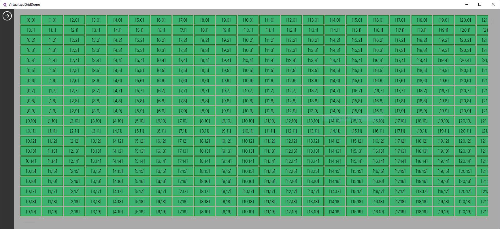

# VirtualizedGrid



## About this control

This control allows you to display a large number of items in two dimensions with virtualization. Virtualization ensures that only the items currently visible are rendered, maintaining performance even when dealing with thousands of items.

This control was created because *Avalonia* lacks a native component with 2D virtualization, and nesting single-dimensional panels with virtualization results in poor performance.

## Limitations

This control is MVP and lacks quite a lot of stuff, but it should work better than native solutions.

**Make sure to be aware of all the limitations before using this in your project !**

 - **Rectangle data sets only** - currently, the control can only handle rectangle data sets. This means that if you have, for example, 10 elements, you can only display them in 1, 2, 5, or 10 columns. If you want to have 3 columns, it will not work at the moment.t

 - **No selecting items** - the control does not currently support item selection.

- **No row/column headers** - the control does not provide row or columns headers.

- **Handling small and/or complex items** - although the performance is better than the native solution, it can still be an issue, especially when dealing with many complex items. `VirtualizedGrid` does not render every item, but if you want to have a full-screen display of, for example, 32x32 controls, it may pose a problem. Currently, the recommended limit is around 1500 moderately complex items. Beyond this limit, you may encounter performance problems. Please note that using the `MaxItemsCache` and `RefreshDelay` properties may help mitigate some minor performance issues.

- **Element focus** - because the control actually renders only what you see, when you e.g. select a `TextBox` and than scroll in any direction this item will preserve focus, although it's data context will change.

 - **Avalonia only** - this control is designed for the [Avalonia](https://github.com/AvaloniaUI/Avalonia) framework, but it should be easily portable to other XAML-based frameworks (such as WPF, WinUI, MAUI...).

## Installation

Until the NuGet package is released, if you'd like to use the `VirtualizedGrid` control, you have to install this component manually. In order to do so, you'd have to follow these steps:

1. Copy `VirtualizedGrid` project into your solution.
2. In your `App.axaml` file add the following:
```xml
<Application.Styles>
    (...)
	<StyleInclude Source="avares://VirtualizedGrid/VirtualizedGrid.axaml" />
</Application.Styles>
```
3. In the view you'd like to dispaly `VirtualizedGrid` control:
```xml
<YourViewControl (...)
	xmlns:g="using:VirtualizedGrid">
```
```xml
<g:VirtualizedGrid
    (...)
    Items={Binding ItemsCollectionSource}
    MaxItemsInRow={Binding MaximumNumberOfColumns}
    >
	<g:VirtualizedGrid.ItemTemplate>
		<DataTemplate>
			<!-- DEFINE HERE HOW THE SINGLE ITEM SHOUD LOOK LIKE -->
		</DataTemplate>
	</g:VirtualizedGrid.ItemTemplate>
</g:VirtualizedGrid>
```
## Documentation

The `VirtualizedGrid` control has a few specific dependency properties. Here's the documentation for them:

 * `Items` - provides a source of items to be displayed by the control
 * `ItemHeight` - Defines the height for each rendered item
 * `ItemWidth` - Defines the width for each rendered item
 * `MaxItemsInRow` - The maximum number of columns that can be rendered by the control. 
 * `ItemTemplate` - Defines a look for each rendered item.
 * `DisableSmoothScrolling` - If set to `true` the smooth scrolling behaviour is disabled. This can boost the performance little bit, but I doubt it's worth it.
* `MaxItemsCache` - Defines the maximum number of rendered items that can be cached. When working with reasonably-sized items, there is usually no need to change the default value (0) of this property. However, if you'd like to render small items, such as 32x32, when maximizing the window or providing the control with more space, you might experience some lag. This is because adding items to the core panel of the `VirtualizedGrid` control can be a quite heavy operation. Consequently, when the size changes rapidly, like when maximizing the window, the control tries to add all the required items at once. To avoid this heavy operation, you can choose to cache some of the previously rendered items. Although this approach consumes memory, it can improve performance during control resizing.

* `RefreshDelay` - Specifies the delay in milliseconds between the last layout refresh and the update of the control's state. This property can help maintain performance when displaying multiple relatively small-sized items. For example, during scrolling, the `LayoutUpdated` event is triggered multiple times, even though it may not be necessary from the user's perspective. By setting this property, for instance, to 50 ms, the update of the control's state will only be executed once every 50 ms after the last invocation of `LayoutUpdated`, which improves performance.

